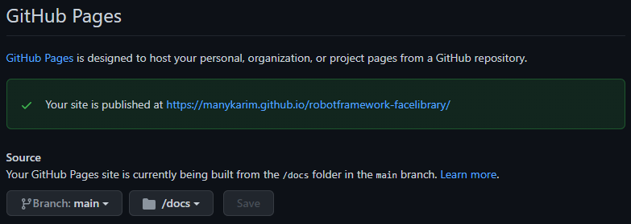

# For the very first time  
This repository shall provide additional information about the RoboCon 2022 Talk "For the very first time".  
The talk will describe how to release a new Robot Framework Library to the community.  
The goal is to have a package which can be installed with
``pip install robotframework-myfirstlibrary``.  

You can find the example library which is used during the talk [here](https://github.com/manykarim/robotframework-facelibrary)

## Releasing is more than just Coding..

Releasing a Robot Framework Library to the public is more then just a bit of coding in Python.  
Maintaining and releasing an open source library requires:

- a proper repository structure
- handling of your library and development dependencies
- versioning and publishing (to PyPi)
- documentation of your library and the keywords it provides
- Unit tests and Acceptance tests
- Using Continuous Integration (CI) to build, test and release your library
- Automating the recurring tasks

### Repository Structure
``` 
robotframework-myfirstlibrary
├── MyFirstLibrary
│   ├── __init__.py
│   └── myfirstlibrary.py
├── atest
│   └── atest.robot
├── docs
│   ├── README.md
│   └── myfirstlibrary.html
├── pyproject.toml
├── tasks.py
└── utest
    └── test_myfirstlibrary.py
```

``robotframework-myfirstlibrary`` is the `distribution name` of the library.  
It can later be used to install the library with `pip install robotframework-myfirstlibrary`.  
It's also the name of the `GitHub Repository`.


`MyFirstLibrary` is the name of the `Python Package`.  
It can later be used to import the library into Robot Framework.

``` Robot Framework
*** Settings ***
Library    MyFirstLibrary

*** Test Cases ***
Use a keyword from MyFirstLibrary
   My First Library Keyword     # Use the keyword from MyFirstLibrary
```

The `__init__.py` file is the `Python Package Init File`.  
It will be executed when the package is imported.  
It needs to import the Class `MyFirstLibrary` from the module `myfirstlibrary.py`.
Only afterwards the `keywords` from the `MyFirstLibrary` class can be used.

`__init__.py`
``` Python
from .myfirstlibrary import MyFirstLibrary
```


### Dependencies

Install poetry

```shell
curl -sSL https://raw.githubusercontent.com/python-poetry/poetry/master/get-poetry.py | python
```

After setting up the folder structure in your project, you can initialize the project with poetry.

```shell
poetry init
```

Poetry will run an interactive setup wizard to help you configure your project.  
It will ask for information like:

- The name of the project
- The name of the author
- The name of the license
- The version of the project
- The dependencies of the project
- The development dependencies of the project

After the setup wizard is finishes, poetry will create a `pyproject.toml` file.

You can now install the dependencies into a virtual environment with:

```shell
poetry install
```

You can always use the command `poetry run`,  to run any commands in the virtual environment.
You can activate the virtual environment with:

```shell
poetry shell
```
If you need to add a new dependency, you can use the command `poetry add`.

### Versioning

Versions are defined by the `major.minor.patch` format and can be incremented by poetry.  
If the current version is `1.2.3`:
- `poetry version patch` will increment the patch number to `1.2.4`
- `poetry version minor` will increment the minor number to `1.3.0`
- `poetry version major` will increment the major number to `2.0.0`

### Documentation
#### Documentation of the Library

The documentation of the Library is added as Docstrings to the Python source code.  
Depending on the location of the documentation, it can be added to the `README.md` file or to the keyword documentation `docs/myfirstlibrary.html` file which is hosted via GitHub Pages.  

```python
class MyFirstLibrary:
    """
    This is a DocString for the Keyword Documentation.  
    It can explain some general things, like what the Library does and how it works.  

    Also the options to import the Library can be explained here with examples.

    """
    def __init__(self) -> None:
        cascade_path = os.path.join(os.path.dirname(__file__), 'haarcascade_frontalface_default.xml')
        self.face_cascade = cv2.CascadeClassifier(cascade_path)
```

#### Documentation of the Keywords

The documentation of the Keywords is added as Docstrings to the Python source code.

It can later be converted to a keyword documentation file with 

```shell
python -m robot.libdoc MyFirstLibrary
```

```python
    def is_face_in_image(self, img: str):
        """Returns ``True`` if a face is detected in the image ``img``, ``False`` otherwise.  

        ``img``: The path to the image

        Example:

        | Should Contain A Face | faces.png |
        | Should Contain A Face | ${CURDIR}/another_face.jpg |
        """
        img = cv2.imread(img)
        gray = cv2.cvtColor(img, cv2.COLOR_BGR2GRAY)
        faces = self.face_cascade.detectMultiScale(gray, 1.1, 4)
        if len(faces)>0:
            return True
        else:
            return False
```

#### Hosting the Documentation via GitHub Pages

Store the generated documentation in a folder called `docs`.
Enable GitHub Pages for the repository and select the folder `docs` as the source.




### Tests

I recommend a combination of *Unit Tests* and *Acceptance Tests*.
The goal of Unit Tests is to achieve a high level of code coverage and to cover all functions of the library in depth.  
The goal of Acceptance Tests is to test the functionality of the library in real world scenarios. It's also serves as some living documentation.

There are different approaches how your tests can be organized.  
Maybe you prefer a single `tests/` folder to store all your tests.

Or you like so separate your unit tests and acceptance tests into folders `utest/` and `atest/`. 

#### Unit Tests

Use a Unit Testing Framework like `unittest` or `pytest` to write unit tests.  
The filename starts with `test_` and the test function name starts with `test_`.

You can run them with

```shell
python -m pytest  utest/"
```	
or via coverage
```shell
coverage run --source=MyFirstLibrary -p -m pytest utest/
coverage report
coverage html
```


```python
from pathlib import Path
from MyFirstLibrary import MyFirstLibrary
import pytest

testdata_directory = Path(__file__).parent.resolve() / "testdata"
face_detector = MyFirstLibrary()
image_with_face = str(testdata_directory /'faces.png')
image_without_face = str(testdata_directory /'no_faces.jpg')

def test_image_should_contain_a_face():
    assert face_detector.is_face_in_image(image_with_face) == True
    face_detector.should_contain_a_face(image_with_face)

def test_image_should_not_contain_a_face():
    assert face_detector.is_face_in_image(image_without_face) == False
    face_detector.should_not_contain_a_face(image_without_face)

def test_assertion_error_should_be_raised():
    with pytest.raises(AssertionError):
        face_detector.should_contain_a_face(image_without_face)
    with pytest.raises(AssertionError):
        face_detector.should_not_contain_a_face(image_with_face)
```

#### Acceptance Tests

Use Robot Framework to write acceptance tests.

```robot
*** Settings ***
Library    MyFirstLibrary

*** Variables ***
${TESTDATA}    ${CURDIR}/testdata
${image_with_face}    ${TESTDATA}/faces.png
${image_without_face}    ${TESTDATA}/no_faces.jpg
${no_face_detected_error}    Image should contain a face. But no face was detected
${face_detected_error}    Image should NOT contain a face. But it contains a face

*** Test Cases ***
Image Should Contain Face
    Should Contain A Face    ${image_with_face}

Image Should Not Contain A Face
    Should Not Contain A Face    ${image_without_face}
```

#### Coverage

Use the `coverage` tool to analyze the test coverage of your library.  
You can run tests with `coverage run` and analyze the coverage with `coverage report`.  
If you run the tests with `coverage run`, you can also generate a HTML report with `coverage html`.
Multiple test runs (e.g. for Unit Tests and Acceptance Tests) can be analyzed with `coverage combine`.

Example:
    
```shell
coverage run --source=MyFirstLibrary -p -m pytest utest/
coverage run --source=MyFirstLibrary -p -m robot atest/
coverage combine
coverage report
coverage html
```    

### Continuous Integration

Use GitHub Actions to automate the release process.

### Automating the recurring tasks

Use the included `tasks.py` file to automate the recurring tasks via the `invoke` command.

```shell
invoke tests
invoke libdoc
invoke readme
```

```python
ROOT = pathlib.Path(__file__).parent.resolve().as_posix()
VERSION = version("robotframework-myfirstlibrary")

@task
def utests(context):
    cmd = [
        "coverage",
        "run",
        "--source=MyFirstLibrary",
        "-p",
        "-m",
        "pytest",
        f"{ROOT}/utest",
    ]
    subprocess.run(" ".join(cmd), shell=True, check=False)

@task
def atests(context):
    cmd = [
        "coverage",
        "run",
        "--source=MyFirstLibrary",
        "-p",
        "-m",
        "robot",
        "--loglevel=TRACE:DEBUG",
        f"{ROOT}/atest",
    ]
    subprocess.run(" ".join(cmd), shell=True, check=False)

@task(utests, atests)
def tests(context):
    subprocess.run("coverage combine", shell=True, check=False)
    subprocess.run("coverage report", shell=True, check=False)
    subprocess.run("coverage html", shell=True, check=False)
```


